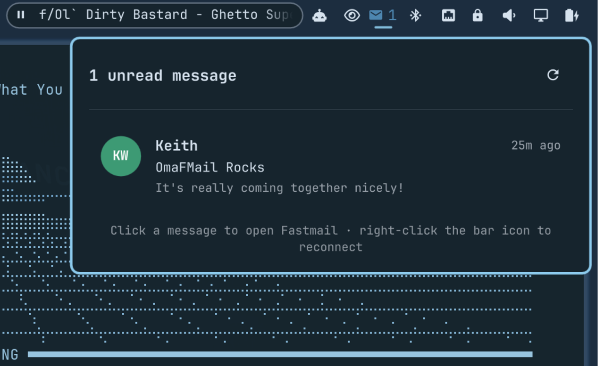

# MailNotifier

> This is a fork of [OmaFMail](https://github.com/keithnyc/omafmail) by
> [Keith](https://github.com/keithnyc), originally licensed under the MIT
> License (see [LICENSE](LICENSE)). Renamed from OmaFMail to MailNotifier
> (plugin id `io.github.echograv.mailnotifier`). Changes from upstream:
>
> - The bar widget now hides itself entirely (zero width/height, not
>   just visually inactive) when there's no unread mail and no error,
>   instead of always showing an inactive icon.
> - The unread-count label's `active` state is now always `false`, and
>   its foreground color turns red on error, otherwise matches the bar's
>   default foreground.
> - Clicking a message in the popup, or clicking a desktop notification,
>   now opens your system's default mail client's main window (resolved
>   via `xdg-mime`, launched without arguments so it doesn't open a
>   compose window), instead of a hardcoded `thunderbird` call / opening
>   Fastmail's web inbox in a browser. The popup's footer hint text was
>   updated to match ("open your mail client" instead of "open
>   Fastmail").
> - Config, state, and keyring paths/identifiers renamed to match:
>   config now lives at `~/.config/mailnotifier/config.json`, state at
>   `~/.local/state/mailnotifier/`, and the default `secretService` /
>   notification app-name is now `mailnotifier` instead of `omafmail`.
> - New file `scripts/open_mail_client.sh` implementing that resolution
>   and launch logic, with a fallback to Fastmail's web inbox if no
>   default handler can be found.

MailNotifier is an Omarchy shell plugin that watches a Fastmail (or other
IMAP) mailbox over a persistent IMAP IDLE connection and shows unread
mail — sender, subject, and a text preview — in a native bar popup, with
desktop notifications when new mail actually arrives.

It exists because leaving the Fastmail web app open in a background tab
doesn't refresh the inbox until that tab has focus.




## Current features

- Persistent IMAP IDLE connection: near-instant notification of new mail,
  not polling
- Bar badge showing unread count; click to open a popup with sender,
  subject, and a short preview of each unread message
- Desktop notification only for mail that's new since the last time you
  saw it — no notification flood on first install or on reconnect
- Read-only IMAP session (`SELECT ... READONLY`, `BODY.PEEK[]` fetches):
  this plugin can never mark your mail as read
- App password stored in the system keyring (Secret Service /
  `secret-tool`), never written to a config file
- Automatic reconnect with backoff on network errors; a slower backoff
  (5 min) on auth/config errors so a bad password doesn't hammer the
  server
- Click a message, or click a desktop notification, to open your
  system's default mail client (main window, not a compose window);
  right-click the bar icon, or use the popup button, to reconnect
  immediately

## Install

Install directly from GitHub and enable the bar widget:

```bash
omarchy plugin add https://github.com/EchoGrav/mailnotifier.git --enable
```

## Install for local development

Install the plugin by linking this checkout into Omarchy's user plugin
directory:

```bash
ln -s "$PWD" ~/.config/omarchy/plugins/io.github.echograv.mailnotifier
omarchy-shell shell rescanPlugins
omarchy plugin enable io.github.echograv.mailnotifier right
```

## Setup

1. Create a Fastmail app password: Settings → Privacy & Security → App
   passwords, with **IMAP** access only. Fastmail passwords with 2FA
   enabled will not work directly with IMAP; an app password is required.

2. Store it in the system keyring — nothing else reads or writes this:

   ```bash
   secret-tool store --label="MailNotifier: you@fastmail.com" service mailnotifier account you@fastmail.com
   ```

   You'll be prompted to paste the app password. `secret-tool` needs a
   running Secret Service provider (GNOME Keyring is already active on
   most Omarchy installs — `gnome-keyring-daemon`).

3. Create your configuration:

   ```bash
   mkdir -p ~/.config/mailnotifier
   cp ~/.config/omarchy/plugins/io.github.echograv.mailnotifier/config.example.json \
     ~/.config/mailnotifier/config.json
   ```

   Edit `~/.config/mailnotifier/config.json` with your Fastmail address. The
   `account` and `secretService` values must match what you used with
   `secret-tool store` above.

## Configuration

MailNotifier watches `~/.config/mailnotifier/config.json` and reconnects
automatically when it changes.

- `account`: your Fastmail email address (also the `secret-tool` lookup key)
- `host`: IMAP host, default `imap.fastmail.com`
- `port`: IMAP port, default `993`
- `mailbox`: mailbox to watch, default `INBOX`
- `secretService`: the `service` attribute used with `secret-tool`, default `mailnotifier`
- `fetchLimit`: max unread messages to fetch/display, default `20`

## Dependencies

- Omarchy shell with third-party service and bar-widget support
- Python 3 (standard library only — no pip installs)
- A running Secret Service provider and `secret-tool` (`libsecret`)
- `omarchy-notification-send`

Plugins execute unsandboxed inside `omarchy-shell`. Review local and
third-party plugin code before enabling it.

## Remove

```bash
omarchy plugin remove io.github.echograv.mailnotifier
```

Removal leaves your configuration, keyring entry, and local state intact.
If you no longer want that data:

```bash
rm -rf ~/.config/mailnotifier ~/.local/state/mailnotifier
secret-tool clear service mailnotifier account you@fastmail.com
```

## Privacy

MailNotifier connects to your IMAP server directly from your computer.
Configuration lives in `~/.config/mailnotifier/config.json` (no secrets);
the app password lives only in your system keyring; a small state file
recording which message IDs you've already seen (used to avoid
re-notifying on reconnect) lives in `~/.local/state/mailnotifier/state.json`.
None of this belongs in this repository.

## Limitations

- "Click a message" opens your default mail client's general inbox view,
  not a deep link to that exact message — IMAP UIDs don't map cleanly to
  any particular client's internal message IDs.
- The default mail client is resolved via `xdg-mime` (the mailto: URI
  handler). If no default is registered, or the app's `.desktop` file
  can't be parsed, it falls back to opening Fastmail's web inbox.
- The preview is the plain-text part of the message; HTML-only mail
  without a plain-text alternative may show a rough or empty snippet.

## License

MIT
